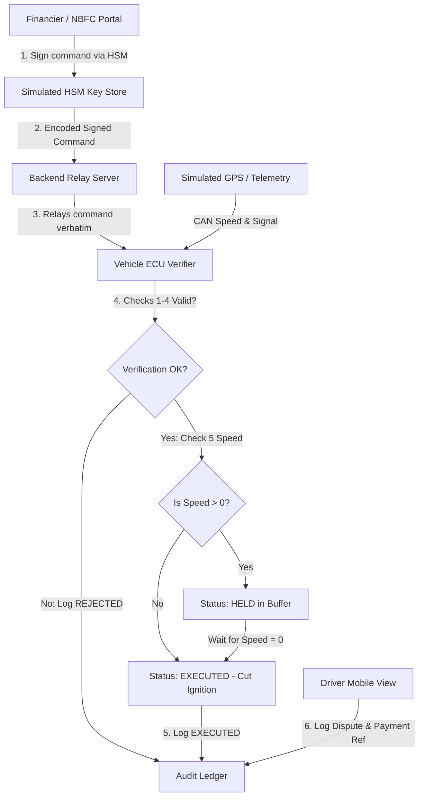
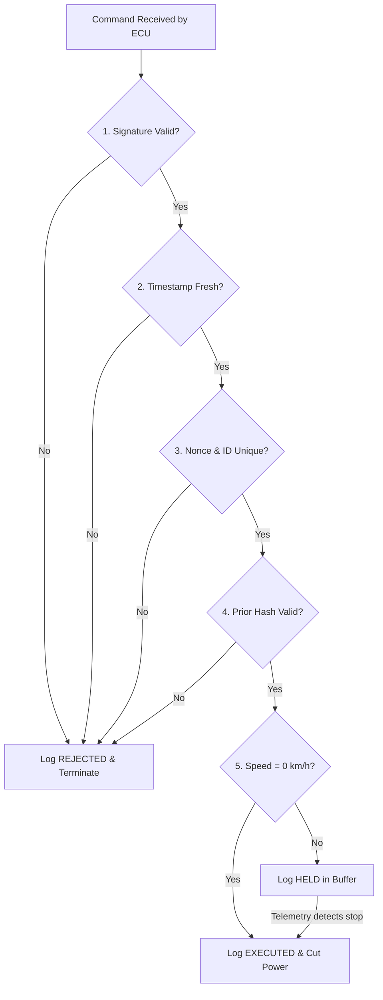

<p align="center">
  
</p>

<p align="center">
  <strong>Zero-Trust Decentralized Cryptographic Remote Vehicle Governance Platform</strong>
</p>

<p align="center">
  <a href="https://nextjs.org/"></a>
  <a href="https://react.dev/"></a>
  <a href="https://typescriptlang.org/"></a>
  <a href="https://tailwindcss.com/"></a>
  <br>
  <a href="https://nodejs.org/"></a>
  <a href="https://expressjs.com/"></a>
  <a href="https://en.wikipedia.org/wiki/Cryptography"></a>
  <a href="https://en.wikipedia.org/wiki/Cybersecurity"></a>
  <br>
  <a href="https://sih.gov.in/"></a>
  <a href="https://opensource.org/licenses/MIT"></a>
</p>

<p align="center">
  <a href="https://trustride-frontend.onrender.com/"><strong>🌐 Live Demo URL</strong></a>
  ·
  <a href="https://github.com/Kanneboinashivakumar/TrustRide"><strong>🐱 GitHub Repository</strong></a>
  ·
  <a href="docs/ARCHITECTURE.md"><strong>📄 Technical Documentation</strong></a>
</p>

---

## 📖 Project Overview

### The Real-World Problem
Modern connected Electric Vehicles (EVs) rely on centralized IoT architectures and Battery Management Systems (BMS) for remote administration. When a vehicle financier (NBFC) or fleet manager needs to enforce lease compliance or recover a stolen vehicle, they issue a remote shutdown. 

However, current implementations present severe safety and security vulnerabilities:
* **Centralized Server Trust**: If the central command-and-control server is compromised, hackers gain unilateral ability to disable entire transit networks.
* **Lack of Multi-Key Governance**: Fleet operations rely on single-token APIs or unauthenticated local BLE commands, prone to replay and spoofing attacks.
* **High-Speed Disablement Hazards**: Turning off a vehicle's motor while it is traveling at high speeds can cause fatal accidents, violating safety standards.

### The TrustRide Solution
**TrustRide** addresses these vulnerabilities by establishing a decentralized, zero-trust cryptographic command verification pipeline. In the TrustRide protocol:
1. **The Backend Server is Untrusted**: The central server cannot generate or sign authorization commands. It acts strictly as an untrusted message broker relay.
2. **On-Board Asymmetric Signature Verification**: Commands are signed by a simulated Hardware Security Module (HSM) key slot and verified natively on the vehicle's electronic control unit (ECU) against pre-provisioned trust stores.
3. **Firmware-Governed Safety Interlocks**: GPS and wheel-speed telemetry are checked on the vehicle. If the vehicle is in motion, the ECU queues the command in a deferred `HELD` state. The motor relay is disabled **only** when velocity is confirmed to be exactly 0 km/h.
4. **Tamper-Evident Chronological Auditing**: Transactions are linked sequentially using SHA-256 blocks, ensuring all commands, disputes, and resets are immutable and audit-ready.

---

## ✨ Key Features

| Feature | Category | Description |
|---|---|---|
| 🔐 **Secure Remote Immobilization** | Security | Cryptographically authorized power isolation that overrides standard vehicle ignition. |
| ✍️ **Asymmetric Verification** | Cryptography | ECU-side signature checking using ECDSA P-256 public keys stored in secure firmware. |
| 🛡️ **Replay Protection** | Cryptography | Strict nonce and command UUID checks preventing the reuse of intercepted authorization packets. |
| 🚦 **Motion Safety Interlock** | Safety | Telemetry-aware safety interlock that defers execution of override commands if speed > 0. |
| 🔗 **Immutable Audit Ledger** | Integrity | SHA-256 hash-chained block ledger that renders any post-hoc database tampering immediately visible. |
| ⚖️ **Driver Dispute Portal** | Compliance | Allows drivers to append dispute records with payment reference hashes directly to the audit log. |
| 🎬 **Auto Demo Mode** | Presentation | A 12-step guided player showcasing threat simulations, interlock states, and ledger forensics. |
| 🕵️ **Presenter's Judge Mode** | Presentation | Syncs dynamic pop-up SecOps annotations detailing exactly which ECU checks run at each step. |
| ⚡ **Interactive Attack Simulator** | Threat Sandbox | Triggers replay, MITM payload modifications, rogue issuer, and stale commands to show ECU rejects. |
| 📊 **Enterprise Analytics** | Dashboard | Real-time visualizations of active fleet status, blocked threats, held command queues, and ledger logs. |
| 🗺️ **Digital Twin Map** | Telemetry | Interactive high-fidelity map of Hyderabad, India, tracking simulated vehicles and their routes. |
| 📟 **Simulated HSM Module** | Hardware | Software emulation of secure elements (ECDSA key slot storage, signing, and verification). |

---

## 📐 Platform Architecture

The TrustRide protocol separates key management, transport, verification, and forensic logging:



### Component Details
* **Financier / NBFC Layer**: The administrative gateway where commands are created. Contains no private keys; it sends payloads to the simulated HSM interface to apply signatures.
* **Simulated HSM (Secure Element)**: The cryptographic vault. Holds private keys and outputs ECDSA signatures over canonicalized command packets.
* **Backend Relay Server**: A lightweight Express API server. It does not possess any signing keys and cannot alter command payloads. Its role is strictly message distribution.
* **Vehicle ECU Verifier**: The on-vehicle firmware emulator. It intercepts relayed commands, executes the 5-step verification process, and interacts with the telemetry loop.
* **Audit Ledger**: A tamper-evident block chain. Every command event (Requested, Dispatched, Held, Rejected, Executed, Disputed) is written as a hash-chained block.

---

## 🔒 The 5-Step Security Pipeline

Before executing any remote override, the vehicle ECU passes the command through five sequential checkpoints:



1. **Check 1: Asymmetric Signature Check**: The command fields (Issuer, Action, Nonce, Timestamp) are canonicalized, hashed, and verified against the issuer's public key in the ECU trust store.
2. **Check 2: Freshness Window Check**: System compares the current time with the command timestamp. If it exceeds 5 minutes, it is flagged as expired and discarded.
3. **Check 3: Nonce/Replay Check**: The unique command ID and nonce are verified against the local vehicle log. If seen previously, it is rejected.
4. **Check 4: Hash-Chain Anchoring**: The command must specify the correct hash of the last successfully executed command on that vehicle. If it points to an invalid or stale block, the chain verification fails.
5. **Check 5: Safety Interlock Check**: Reads CAN speed telemetry. If speed is non-zero, command execution is held, maintaining motor power. Execution proceeds only when velocity reaches 0.

---

## ⚔️ Threat Sandbox & Attack Simulations

The interactive threat sandbox allows presenters to trigger actual security exploits and witness the ECU's response:

| Attack Vector | Exploit Description | Blocked By | ECU Result / Response |
|---|---|---|---|
| **BLE Local Sweep** | Attacker scans local Bluetooth ranges and sends raw override payloads directly. | **Check 1: Signature** | **REJECTED**: Commands without a valid signature matching a trusted HSM certificate are ignored. |
| **Man-in-the-Middle (MITM)** | Attacker intercepts a valid signed payload and modifies fields (e.g., target vehicle ID). | **Check 1: Signature** | **REJECTED**: Any mutation breaks the canonical cryptographic hash, causing verification to fail. |
| **Verbatim Replay** | Attacker intercepts a previously executed command and re-sends it to lock the vehicle again. | **Check 3: Replay** | **REJECTED**: The unique nonce and command ID have already been marked as consumed in the ECU log. |
| **Stale Command Playback** | Attacker replays a valid signed command from hours ago to force a lock during vehicle service. | **Check 2: Expiry** | **REJECTED**: The timestamp falls outside the 5-minute freshness window. |
| **Rogue Issuer** | A compromised financier employee signs commands using an unauthorized key pair. | **Check 1: Signature** | **REJECTED**: The signing key is not provisioned inside the vehicle's firmware trust store. |
| **Backend Compromise** | Hackers compromise the central API server database to issue bulk shutdown commands. | **Check 1: Signature** | **REJECTED**: The backend server does not hold the signing keys, rendering it incapable of generating valid commands. |
| **Ledger Tampering** | Attacker gains direct database access to erase history or modify details of an executed lock. | **Hash-Chain Link** | **LEDGER FAULT**: Modifying any field breaks the SHA-256 block chain. Status turns red and flags the broken index. |

---

## 📸 Dashboard Showcase

### Marketing Landing Page & Hero Section
*A sleek, cybersecurity-themed introduction highlighting the on-board ECU status.*


### Control Center & Telemetry Stats
*Overview panel showcasing real-time fleet analytics, active ignition systems, blocked threats, and ledger integrity.*


### Threat Sandbox & Command Dispatcher
*Financier command center and the interactive threat sandbox showing live cryptographic failure logs.*


### Digital Twin Map & Speed Telemetry
*Interactive road map of Hyderabad, India, featuring animated vehicle trails, zoom controls, and motor status gauges.*


### Hash-Chained Audit Ledger Console
*Chronological list of ledger events showing forensic warning indicators and corrective reset block sequences.*


---

## 💻 Technology Stack

* **Frontend Dashboard**:
  * **Core**: Next.js 14 (React 18), TypeScript.
  * **Styling**: TailwindCSS, Vanilla CSS.
  * **Animations & Transitions**: Framer Motion, Canvas Confetti.
  * **Icons**: Lucide React.
* **Backend Services**:
  * **Core**: Node.js, Express (REST API).
  * **Signing & Cryptography**: Native Node `crypto` library (ECDSA P-256 with SHA-256 hashing).
  * **Runtime Watcher**: tsx (TypeScript Execute).
* **Security & Auditing**:
  * **ECU verification**: Custom 5-step verifier engine.
  * **Audit Log**: Custom SHA-256 hash-chain implementation.
* **Hosting & Deployment**:
  * **Dashboard & API Service**: Railway / Render (Long-lived server containers).

---

## 📂 Installation & Local Setup

### Prerequisites
* Node.js (v18.x or v22.x recommended)
* npm (v9.x or later)

### 1. Clone the Repository
```bash
git clone https://github.com/Kanneboinashivakumar/TrustRide.git
cd TrustRide
```

### 2. Install Project Dependencies
Run install in both root directories:
```bash
# Setup backend dependencies
cd backend
npm install

# Setup frontend dependencies
cd ../frontend
npm install
```

### 3. Run Scenario Test Suite
Verify that all 7 cryptographic scenarios pass the API validation checks:
```bash
cd ../backend
npm run test:scenarios
```

### 4. Run Development Servers
Open two separate terminal windows:

**Terminal 1 (Backend API):**
```bash
cd backend
npm run dev
# Server running at http://localhost:4000
```

**Terminal 2 (Frontend Web Portal):**
```bash
cd frontend
npm run dev
# Web app running at http://localhost:3000
```

Open **[http://localhost:3000](http://localhost:3000)** in your browser to run the application.

---

## 🌐 Environment Variables

For local development, default fallbacks are pre-configured. For production environments, configure these variables:

### Frontend (`frontend/.env.production`)
```env
# The public base URL of your deployed Express backend API
NEXT_PUBLIC_API_BASE=https://trustride-backend.onrender.com/api
```

---

## ☁️ Deployment Guides

Because the backend maintains simulated vehicle and command state **in-memory** to avoid heavy database dependencies for the demo, it requires a **persistent long-lived server process** (standard Next.js Serverless Functions will recycle and wipe the memory cache).

### Deploying Frontend & Backend on Render (Free Tier)

#### 1. Backend Service
1. Log in to [Render.com](https://render.com) and click **New +** $\rightarrow$ **Web Service**.
2. Connect your GitHub repository.
3. Configure:
   * **Name**: `trustride-backend`
   * **Root Directory**: `backend`
   * **Build Command**: `npm install`
   * **Start Command**: `npm start`
4. Click **Create Web Service**. Once deployed, copy your Render backend URL.

#### 2. Frontend Service
1. Click **New +** $\rightarrow$ **Web Service**.
2. Connect your GitHub repository.
3. Configure:
   * **Name**: `trustride-frontend`
   * **Root Directory**: `frontend`
   * **Build Command**: `npm install && npm run build`
   * **Start Command**: `npm start`
4. Click **Advanced** $\rightarrow$ **Add Environment Variable**:
   * Key: `NEXT_PUBLIC_API_BASE`
   * Value: `https://YOUR-BACKEND-RENDER-URL.onrender.com/api` (append `/api` to your copied backend URL).
5. Click **Create Web Service**.

---

## 📈 Platform Impact & Compliance

### Impact Metrics
* **For Financiers (NBFCs)**: Ensures absolute lease compliance and contract security without risking physical vehicle damage.
* **For EV OEMs**: Shifts security from custom IoT apps directly into the vehicle's firmware, standardizing security protocols.
* **For Fleet Operators**: Limits liabilities by ensuring vehicles can never be turned off mid-ride by rogue employee calls or database hacks.
* **For Insurance Providers**: Standardized cryptographic ignition cut-offs reduce risk profiles, enabling lower fleet premiums.

### Regulatory Compliance Frameworks
Designed in alignment with standard connected vehicle frameworks:
* **AIS-156**: EV Battery & Power Isolation Safety Standards.
* **ISO 26262**: ASIL-D Functional Safety compliance for automotive electrical systems.
* **UNECE R155**: Cybersecurity Management System (CSMS) requirements for connected vehicles.
* **ISO/SAE 21434**: Automotive Cybersecurity Engineering lifecycle models.

---

## 🗺️ Roadmap & Performance Metrics

### Future Milestones
* [ ] **Physical HSM Integration**: Test verifications using physical ATECC608 secure element boards.
* [ ] **CAN Bus Integration**: Implement command decoding over simulated CAN network frames.
* [ ] **Multi-Signature Policies**: Require multiple distinct financier signatures for vehicle immobilization.
* [ ] **Offline Verification**: Establish offline fallback verification using time-based one-time tokens.

### Performance & UI Standards
* **Fluid Layouts**: Responsive glassmorphic layout optimized for mobile, tablet, and 4K displays.
* **Dynamic Animations**: Telemetry speed dials and animated vehicle trails rendered at 60 FPS.
* **Production Compiled**: 100% type-safe compilation with zero TypeScript errors or linter warnings.

---

## 👥 Contributors

* **Kanneboina Shiva Kumar** - *Core Architecture & Fullstack Development* - [GitHub Profile](https://github.com/Kanneboinashivakumar)

---

## 📄 License
This project is licensed under the MIT License - see the [LICENSE](LICENSE) file for details.

---

<p align="center">
  Built with ❤️ for safer and more secure connected mobility.
</p>
