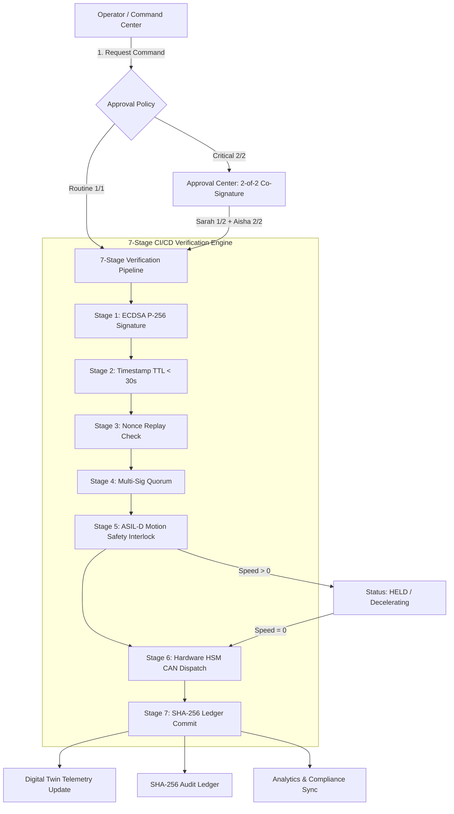

<div align="center">


### Zero-Trust, Hardware-Cryptographic Remote EV Fleet Governance Platform

*Governed, multi-signature verified & motion-safe remote vehicle command execution — replacing unauthenticated direct API overrides with end-to-end cryptographic accountability.*

[](https://vitejs.dev/)
[](https://react.dev/)
[](https://www.typescriptlang.org/)
[](https://nodejs.org/)
[](#-the-7-stage-verification-pipeline)
[](https://vitest.dev/)
[](./LICENSE)

[Live Demo Console](http://localhost:5173) · [Backend REST API](http://localhost:4000) · [Immobilization Evidence](./docs/EVIDENCE_IMMOBILIZATION.md) · [Restoration Evidence](./docs/EVIDENCE_RESTORATION.md) · [5-Min Pitch Script](./docs/DEMO_PITCH_SCRIPT.md)

</div>

---

## 📖 Table of Contents

- [The Problem](#-the-problem)
- [The Gap Nobody Fixed](#-the-gap-nobody-fixed)
- [The TrustRide Solution](#-the-trustride-solution)
- [Complete Master Demo Workflow](#-complete-master-demo-workflow)
- [Platform Architecture](#-platform-architecture)
- [The 7-Stage Verification Pipeline](#-the-7-stage-verification-pipeline)
- [Approval Center & Multi-Signature Governance](#-approval-center--multi-signature-governance)
- [Command Center & Vehicle State Awareness](#-command-center--vehicle-state-awareness)
- [Digital Twin & Telemetry Simulation](#-digital-twin--telemetry-simulation)
- [Simulated Hardware Security Architecture](#-simulated-hardware-security-architecture)
- [Threat Sandbox vs Scenario Simulator](#-threat-sandbox-vs-scenario-simulator)
- [Immutable SHA-256 Audit Ledger](#-immutable-sha-256-audit-ledger)
- [Analytics & Regulatory Compliance Mapping](#-analytics--regulatory-compliance-mapping)
- [UI & Workflow Gallery](#-ui--workflow-gallery)
- [Technology Stack](#-technology-stack)
- [Prototype Scope vs Production Hardware Roadmap](#-prototype-scope-vs-production-hardware-roadmap)
- [License](#-license)

---

## 🚨 The Problem

In commercial Electric Vehicle (EV) fleets across e-rickshaws, 3-wheelers, and commercial logistics, remote commands (such as immobilizations, door locks, and OTA updates) are routinely issued by NBFC financiers, fleet managers, and operators.

However, 99% of current fleet management platforms execute remote commands **directly over unauthenticated REST APIs or unprotected cellular/BLE channels** without multi-approver quorum verification, hardware security module validation, or motion safety checks.

This creates three critical vulnerabilities:

1. **Centralized, Unauthenticated Power** — If an operator credential or server API key is compromised, an attacker gains unilateral ability to disable vehicles blindly.
2. **Missing Motion Safety Interlocks** — Commands execute instantly without checking whether the vehicle is traveling at 40 km/h on a highway, creating catastrophic physical safety hazards.
3. **Absence of Non-Repudiable Evidence** — When a vehicle is remotely disabled, there is no cryptographic record of who authorized the command, why, or under what conditions, leading to unresolvable legal disputes.

---

## 🎯 The Gap Nobody Fixed

Banning vulnerable apps does not eliminate the architectural pattern. The underlying issue is that **even a fully legitimate remote command — issued by an authorized financier for a valid loan default — lacks cryptographic authentication, motion safety interlocks, and non-repudiable accountability.**

> **Core Principle:** No single person or server should unilaterally disable a vehicle, and no command should execute on a moving vehicle without safety interlocks.

---

## 💡 The TrustRide Solution

TrustRide replaces direct API command execution with a **Zero-Trust, Hardware-Cryptographic Remote Fleet Command Platform**:

* **Backend as Relay & Synchronization Layer:** The backend server cannot unilaterally create or sign commands. It strictly acts as a transport relay.
* **Simulated Hardware Security Module (HSM) Signing:** Every command is cryptographically signed using ECDSA P-256 keys.
* **Multi-Signature Governance Quorum:** Critical actions (like Emergency Immobilization) require **2-of-2 dual-approver co-signatures** (represented in the prototype by Security Admin Sarah Kim and Operations Manager Aisha Khan).
* **7-Stage CI/CD Security Pipeline:** Commands run through sequential validation checks before hardware release.
* **Firmware ASIL-D Motion Interlock:** Telemetry is verified in real-time. Commands issued to moving vehicles are held until speed safely reaches **0.0 km/h**.
* **SHA-256 Immutable Audit Ledger:** Every command lifecycle event is committed to a hash-chained audit log with cryptographic tamper detection.

---

## 🔄 Complete Master Demo Workflow

```
Fleet Management Overview
       ↓
Select Target EV (e.g. Sargam Rickshaw TR-101)
       ↓
Command Center (Select Command + Legal Reason)
       ↓
Evaluate Risk, Hardware Target & Approval Policy
       ↓
Approval Center
 ├── Routine Commands (Lock/Unlock) → 1/1 Direct Approval
 └── Critical Commands (Immobilize) → 2-of-2 Multi-Signature Quorum (Sarah 1/2 + Aisha 2/2)
       ↓
7-Stage CI/CD Verification Pipeline
 ├── 1. ECDSA P-256 Signature Verification
 ├── 2. Epoch Timestamp TTL Freshness Check (<30s)
 ├── 3. Single-Use Nonce Replay Protection
 ├── 4. Governance Quorum Threshold Check (2/2)
 ├── 5. ASIL-D Motion Safety Interlock (Hold until Speed = 0 km/h)
 ├── 6. Vehicle Hardware HSM CAN Frame Dispatch
 └── 7. SHA-256 Hash Chain Ledger Commitment
       ↓
Simulated Hardware & ECU Execution
       ↓
Digital Twin Real-Time Telemetry Update (Deceleration 28 → 0 km/h)
       ↓
Immutable SHA-256 Audit Ledger Commitment
       ↓
Analytics Dashboard & Regulatory Compliance Mapping
```

---

## 🏗 Platform Architecture

TrustRide enforces strict separation of duties across client portals, cryptographic vaults, backend relays, and vehicle hardware simulators:


```mermaid
graph TD
    Operator[Operator / Command Center] -->|1. Request Command| Policy{Approval Policy}
    
    Policy -->|Routine 1/1| Pipeline[7-Stage Verification Pipeline]
    Policy -->|Critical 2/2| Quorum[Approval Center: 2-of-2 Co-Signature]
    
    Quorum -->|Sarah 1/2 + Aisha 2/2| Pipeline
    
    subgraph "7-Stage CI/CD Verification Engine"
        Pipeline --> V1[Stage 1: ECDSA P-256 Signature]
        V1 --> V2[Stage 2: Timestamp TTL < 30s]
        V2 --> V3[Stage 3: Nonce Replay Check]
        V3 --> V4[Stage 4: Multi-Sig Quorum]
        V4 --> V5[Stage 5: ASIL-D Motion Safety Interlock]
        V5 --> V6[Stage 6: Hardware HSM CAN Dispatch]
        V6 --> V7[Stage 7: SHA-256 Ledger Commit]
    end
    
    V5 -->|Speed > 0| Deferred[Status: HELD / Decelerating]
    Deferred -->|Speed = 0| V6
    
    V7 --> Twin[Digital Twin Telemetry Update]
    V7 --> Audit[SHA-256 Audit Ledger]
    V7 --> Analytics[Analytics & Compliance Sync]
```

---

## 🛡️ The 7-Stage Verification Pipeline

The pipeline runs sequentially for every command. If any check fails, execution immediately halts or enters a safety hold:

| Stage # | Stage Name | Technical Verification Logic | Execution Target |
| :--- | :--- | :--- | :--- |
| **Stage 1** | **ECDSA Signature Verification** | Validates Secp256r1 curve signature using Simulated Hardware Security Module (HSM) key pair | `< 2.5 ms` |
| **Stage 2** | **Timestamp Validation** | Checks epoch timestamp freshness against a strict `<30s` expiration window | `< 1.5 ms` |
| **Stage 3** | **Replay Protection** | Verifies 64-bit single-use nonce to prevent payload re-transmission | `< 1.0 ms` |
| **Stage 4** | **Multi-Signature Quorum** | Confirms 2-of-2 governance authorization policy has been met | `< 3.5 ms` |
| **Stage 5** | **Motion Safety Interlock** | Enforces ASIL-D speed threshold check (defers execution if speed > 0 km/h) | `< 4.5 ms` |
| **Stage 6** | **Vehicle HSM Dispatch** | Formats encrypted CAN bus frame (ID `0x7E0`) via vehicle gateway | `< 28.0 ms` |
| **Stage 7** | **SHA-256 Audit Recording** | Binds transaction block to the Merkle hash-chain audit ledger | `< 3.5 ms` |

---

## 🔑 Approval Center & Multi-Signature Governance

TrustRide categorizes commands by risk level to balance operational speed with safety:

- **Routine Commands (Single Approval 1/1):** Door Lock/Unlock, Telematics Reset, OTA Firmware Update — can be executed directly by a single authorized operator.
- **Critical Commands (2-of-2 Multi-Signature Quorum):** Emergency Immobilization, Battery Isolation, Remote Lockdown — require co-signatures from two distinct enterprise roles.

> **Simulated Enterprise Quorum:** In the prototype demo, Sarah Kim (Security Admin) initiates the request (1/2), and Aisha Khan (Operations Manager) provides the second PIN co-signature (2/2) to authorize dispatch.

---

## 🎛️ Command Center & Vehicle State Awareness

The Command Center evaluates vehicle telemetry in real-time before generating payloads:

- **Context-Aware Parameters:** Automatically populates legal reason (e.g. Loan Default Recovery), affected hardware controllers (BMS / Motor Inverter), approval policy, and driver notification text.
- **Dynamic Risk Rating:** Assesses speed, battery level, location, and motion safety requirements prior to submission.

---

## 🛺 Digital Twin & Telemetry Simulation

During command execution, the Digital Twin provides real-time visual telemetry feedback:

- **Gradual Deceleration Simulation (Immobilization):** When an immobilization command passes quorum on a moving vehicle, the Digital Twin displays the safety hold while speed gradually steps down: `28 → 20 → 12 → 5 → 0 km/h`. Once speed reaches 0 km/h, the motor isolation interlock completes.
- **Re-engagement Acceleration Simulation (Restoration):** When a restoration command is authorized, the Digital Twin steps speed back up: `0 → 12 → 22 → 28 km/h`.
- **Hardware Telemetry Simulation:** Displays real-time updates for door lock status, digital key revocation, motor temperature, controller voltage, and firmware version.

---

## 📟 Simulated Hardware Security Architecture

> **Prototype Boundary & Hardware Simulation:**  
> The current TrustRide prototype simulates vehicle-side security hardware and ECU environments in software. This simulated environment models components including the Simulated Hardware Security Module (HSM), Secure Element key slots, ECU verifier, motor controller, BMS, and telematics gateway. Cryptographic signing and verification utilize **ECDSA P-256**, while **SHA-256** governs audit chain integrity. Physical hardware integration (hardware secure elements and CAN-bus interfaces) represents future production integration work.

---

## 🧪 Threat Sandbox vs Scenario Simulator

TrustRide provides two distinct simulation environments for security demonstration and operational testing:

### 1. Threat Sandbox (Attacker & Malicious Payload Simulations)
Demonstrates how the 7-Stage Pipeline rejects invalid, tampered, or malicious commands:
- **Unauthorized Key** (Blocked at Stage 1)
- **Modified Command Payload** (Blocked at Stage 1)
- **Stale Expiration Timestamp** (Blocked at Stage 2)
- **Nonce Replay Attack** (Blocked at Stage 3)
- **Partial Signature / Missing Quorum** (Blocked at Stage 4)
- **High-Speed Execution Attempt** (Blocked at Stage 5)
- **Ledger Hash Tampering** (Flagged in Audit Ledger)

### 2. Scenario Simulator (Legitimate Operational Workflows)
Demonstrates real-world fleet situations:
- **Vehicle Theft Recovery**
- **Emergency Fleet Lockdown**
- **Scheduled Maintenance Dispatch**

---

## 📜 Immutable SHA-256 Audit Ledger

Every authorized command, hold, dispute, and restoration generates a structured record containing:
`timestamp → vehicleId → command → legalReason → operator → approvers → risk → previousHash → currentHash`

### Visual Hash Chain Lifecycle
```
[Generating Hash] ──▶ [Linking Previous Block] ──▶ [Ledger Updated] ──▶ [Ledger Locked]
```

### Forensic Tamper Detection
If an attacker attempts to alter a historical database entry, the SHA-256 hash relationship breaks instantly:
- Highlights the exact tampered block in red.
- Displays `CHAIN INTEGRITY BROKEN`.
- Re-verifying the chain pinpoints the tampered field.

---

## 📊 Analytics & Regulatory Compliance Mapping

Post-execution events automatically synchronize with the Analytics and Compliance views.

### Regulatory Mappings (Aligned With)
- **AIS-156 / UN ECE R100:** EV Battery Safety & Electrical Isolation Context
- **ISO 26262:** Functional Safety & ASIL-D Speed Interlocks
- **UNECE R155:** Vehicle Cybersecurity Management System (CSMS)
- **ISO/SAE 21434:** Automotive Cybersecurity Engineering

---

## 🖼️ UI & Workflow Gallery

| Module View | Description & Path |
| :--- | :--- |
| **01. Landing Page** | Enterprise architecture overview & comparison (`/`) |
| **02. Executive Dashboard** | Real-time fleet metrics, active threats & telemetry (`/app/dashboard`) |
| **03. Fleet Management** | EV asset grid, health status & driver assignments (`/app/fleet`) |
| **04. Command Center** | Vehicle-state aware command generator (`/app/command-center`) |
| **05. Approval Center** | 1/1 Routine & 2/2 Multi-Sig PIN Co-signature drawer (`/app/approval-center`) |
| **06. Verification Pipeline**| 7-Stage CI/CD cryptographic validation engine (`/app/verification`) |
| **07. Digital Twin** | Real-time 2D route telemetry & deceleration simulation (`/app/digital-twin`) |
| **08. Threat Sandbox** | Live attack simulation & rejection engine (`/app/threat-sandbox`) |
| **09. Audit Ledger** | SHA-256 hash-chained block log & tamper detection (`/app/audit`) |
| **10. Compliance Matrix** | Mapping to ISO 26262, UNECE R155, ISO/SAE 21434 (`/app/compliance`) |

---

## 💻 Technology Stack

```
Frontend:     Vite v6.4 + React 18 + TypeScript + TailwindCSS + Lucide Icons + Framer Motion
Backend:      Node.js + Express REST API (ESM Modules)
Cryptography: ECDSA P-256 (secp256r1 curve) + SHA-256 Merkle Hash Chain Engine
Auth & IAM:   Google OAuth / GIS + Local JWT Session Management
Testing:      Vitest (29/29 Unit & Integration Tests Passing) + TypeScript Strict Check
Simulation:   2D Digital Twin Telemetry Engine + Simulated Hardware Security Module (HSM)
```

---

## 🔬 Prototype Scope vs Production Hardware Roadmap

### Current Software Prototype
- Full 7-stage cryptographic pipeline execution in software.
- 2-of-2 Multi-signature quorum approval workflow.
- 2D Digital Twin telemetry and deceleration simulation.
- SHA-256 hash chain audit ledger with tamper detection.
- Threat Sandbox and Scenario Simulator.

### Future Hardware Production Roadmap
- **Physical Hardware Security Module (HSM):** Integration with hardware Secure Elements (e.g. NXP SE050 / STSAFE).
- **Physical CAN / VCU Integration:** Direct CAN bus frame injection via Vehicle Control Unit (VCU).
- **Physical BMS & Inverter Interlock:** Hardware-level relay isolation.
- **Persistent Production Database:** PostgreSQL / CockroachDB hash-anchoring.

---

## 📄 License

Distributed under the MIT License. See [`LICENSE`](./LICENSE) for details.

---
*© 2026 TrustRide Technologies. Built for secure, accountable EV mobility.*
