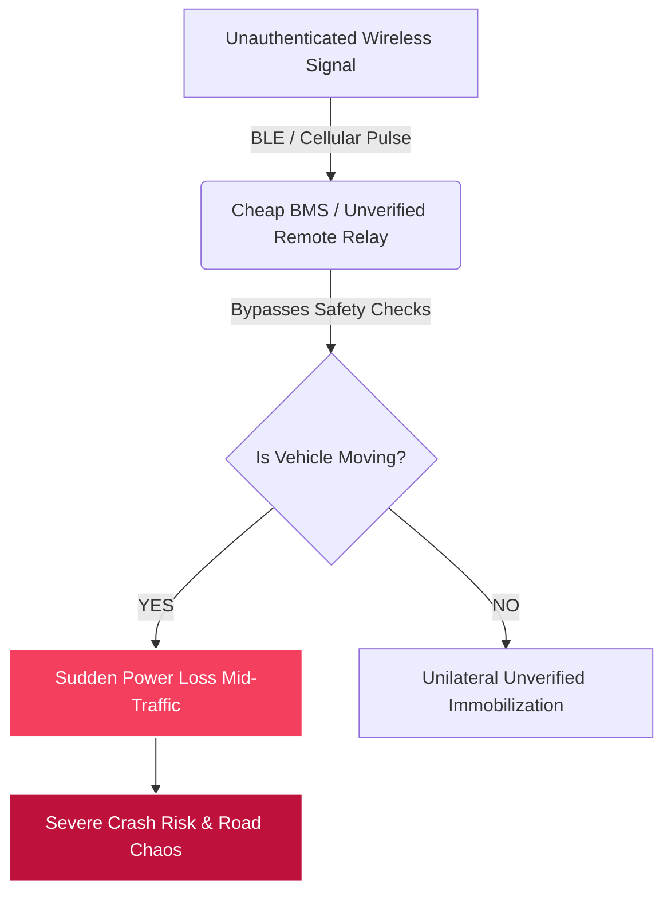
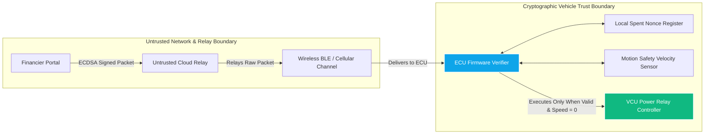
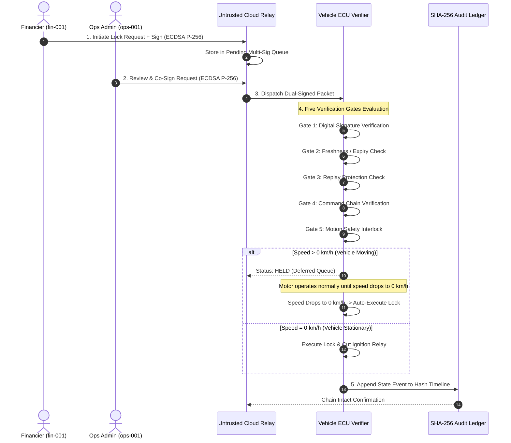
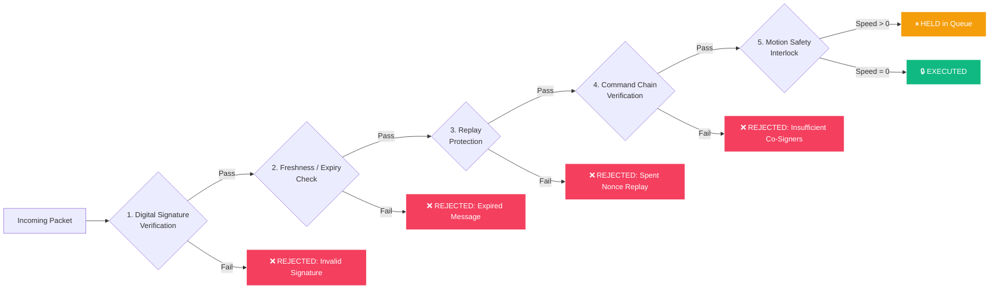
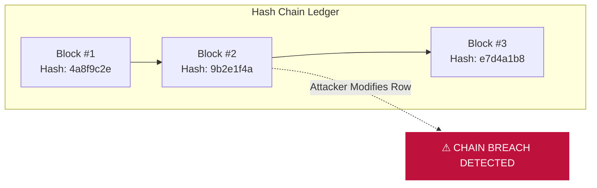
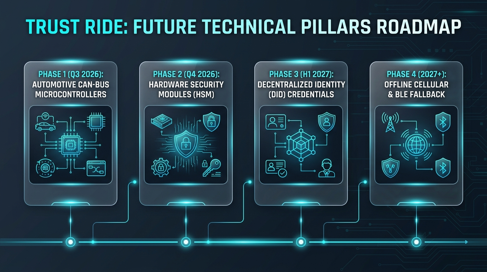

# TrustRide: Zero-Trust Cryptographic Remote EV Governance & Motion-Safe Asset Immobilization Platform


**Comprehensive Technical Project Report & Hackathon Submission Document**  
*Author: Shiva Kumar | Team TrustRide | July 2026*

---

> ### 💡 Central System Thesis
> *"The backend can transport a command, but it cannot authorize a command. The vehicle-side verifier decides whether a command is cryptographically valid, fresh, non-replayed, correctly chained, and physically safe to execute."*

---

## 1. Problem Statement & Real-World Context

### 1.1 The July 2026 BAT-BMS Incident
Commercial electric 3-wheelers (e-rickshaws) and 2-wheelers form the economic backbone of urban last-mile transportation in emerging markets. To protect capital assets against loan default or theft, Non-Banking Financial Companies (NBFCs) and fleet operators equip these vehicles with remote immobilizers.

In July 2026, third-party Android applications (such as *BAT-BMS*) went viral in India after security researchers discovered that cheap, off-the-shelf Battery Management Systems (BMS) accept unauthenticated Bluetooth Low Energy (BLE) commands. Anyone with a smartphone within wireless range could cut power to an active e-rickshaw accelerating through a busy intersection.

While regulatory authorities quickly banned the specific malicious mobile applications within days, the ban fixed the exploit vector without resolving the underlying architectural flaw. The apps were originally legitimate tools built for financiers and fleet operators. Banning the app did not fix the unsafe, unauthenticated design of legacy remote vehicle controls.



### 1.2 Structural Vulnerabilities of Legacy Systems
- **Unauthenticated Wireless Triggers**: Disabling mechanisms accept plain-text cellular or BLE commands without cryptographic digital signature verification.
- **Missing Motion Safety Interlocks**: Remote disable logic executes instantly regardless of vehicle velocity, creating severe accident risks on high-speed roads.
- **Single-Credential Abuse**: A single compromised credential or rogue agent can disable an entire vehicle fleet without administrative co-authorization.
- **Retroactive Audit Alteration**: Events are logged in standard database tables subject to retroactive tampering or silent deletion during legal disputes.

---

## 2. Threat Model & Security Boundaries

TrustRide models an aggressive threat environment where the cloud infrastructure, network transport layer, and mobile applications are assumed to be untrusted or vulnerable to compromise.



### 2.1 Threat Agents & Attack Vectors
1. **Man-In-The-Middle (MITM)**: Intercepting and altering command payloads (e.g., changing action from `MAINTENANCE` to `IMMOBILIZE`).
2. **Replay Attackers**: Intercepting valid signed packets and re-transmitting them later to force unauthorized lock states.
3. **Rogue / Unauthorized Issuers**: Unauthorized brokers or former employees using unapproved key pairs (`fin-999`).
4. **Compromised Cloud Backend**: An attacker gaining full administrative access to the backend database or API relay server.
5. **Partial-Signature Abuse**: Attempting to execute multi-sig commands with only 1 of 2 required signatures.
6. **Malicious Historical Log Tampering**: Modifying database records after an incident to hide responsibility or alter dispute records.

---

## 3. The TrustRide Solution

TrustRide introduces a zero-trust, vehicle-side command governance platform built around three non-negotiable principles:

1. **Safety Before Execution**: Firmware-enforced velocity interlocks prevent motor power cutoffs while the vehicle is in motion.
2. **Cryptographic Authorization**: ECDSA P-256 digital signatures ensure only explicit, authorized key pairs can issue commands.
3. **Complete Accountability**: A tamper-evident SHA-256 hash-chained audit ledger cryptographically logs all state changes and driver disputes.

---

## 4. Architecture & System Overview

TrustRide separates **transportation** from **authorization**. The backend infrastructure serves solely as a packet transport relay.

```mermaid
flowchart TD
    subgraph Governance Layer
        F[Financier Portal<br>Private Key fin-001]
        O[Ops Admin Portal<br>Private Key ops-001]
    end

    subgraph Untrusted Cloud Relay
        R[TrustRide API Backend Relay]
        Q[Pending Multi-Sig Queue]
    end

    subgraph Vehicle-Side ECU Verifier (TR-103)
        V[Five Verification Gates]
        I[Velocity Sensor Interlock]
        M[Motor Ignition Relay]
    end

    subgraph Audit Ledger
        L[Tamper-Evident SHA-256 Hash Timeline]
    end

    F -->|1. Sign & Dispatch| R
    R --> Q
    O -->|2. Co-Sign & Approve| R
    R -->|3. Relay Dual-Signed Packet| V
    V -->|4. Check 1-4 Valid| I
    I -->|Speed = 0 km/h| M
    I -->|Speed > 0 km/h| H[⏸ Defer to HELD State]
    H -->|Speed Reaches 0 km/h| M
    V -->|5. Log State Event| L

    style V fill:#0284c7,stroke:#fff,color:#fff
    style M fill:#059669,stroke:#fff,color:#fff
    style H fill:#d97706,stroke:#fff,color:#fff
```

---

## 5. Implementation Methodology

Development followed a strict 6-stage engineering process:

```
1. Threat Modeling --------> Identify attack vectors (MITM, Replay, Unsafe Shutdown)
2. Trust Boundary Design --> Establish ECU firmware as the sole execution authority
3. Crypto Pipeline --------> Implement ECDSA P-256 signing & Web Crypto verifier
4. Attack Simulation ------> Build Threat Sandbox testing 5 distinct exploit vectors
5. Safety Validation ------> Engineer velocity interlock deferring execution to 0 km/h
6. Audit Verification ------> Implement SHA-256 hash chaining with real-time breach alerts
```

---

## 6. End-to-End Command Workflow

The complete lifecycle of a remote command follows a strict sequence:



---

## 7. The Five Verification Gates

Every incoming command packet must pass five sequential verification gates inside the vehicle verifier before modifying hardware ignition state:



### Gate 1: Digital Signature Verification
Verifies the cryptographic ECDSA P-256 signature of the payload against public keys registered in the vehicle verifier's trusted key store.

### Gate 2: Freshness / Expiry Check
Validates that the command creation timestamp is within a strict 5-minute validity window ($\Delta t \le 300\text{s}$). Stale commands are rejected immediately.

### Gate 3: Replay Protection
Queries a local spent nonce registry. If the command nonce has already been registered, execution is blocked to prevent verbatim packet replay.

### Gate 4: Command Chain Verification
Enforces administrative governance policies. Under multi-sig policy, the packet must carry 2-of-2 valid co-signatures (Financier `fin-001` + Operations Admin `ops-001`).

### Gate 5: Motion Safety Interlock
Evaluates real-time velocity telemetry. If vehicle speed exceeds 0 km/h, the command enters a deferred `HELD` state. Motor power is maintained until speed reaches 0 km/h, at which point the lock executes automatically.

---

## 8. Threat Sandbox & Security Verification Results

The prototype includes an automated Threat Sandbox validating system resilience across 8 implemented scenario tests:

| Test Scenario | Evaluated Threat Vector | Verification Mechanism | Status |
| :--- | :--- | :--- | :--- |
| **Scenario 1** | Unsafe Motion Lock Attempt | Gate 5 Motion Interlock defers command to `HELD` state | ✅ **PASSED** |
| **Scenario 2** | Vehicle Speed Deceleration to 0 km/h | Gate 5 releases held command upon reaching 0 km/h | ✅ **PASSED** |
| **Scenario 3** | MITM Payload Mutation | Gate 1 Signature Verification fails on modified bytes | ✅ **PASSED** |
| **Scenario 4** | Stale / Expired Packet Replay | Gate 2 Expiry Check detects timestamp $\Delta t > 300\text{s}$ | ✅ **PASSED** |
| **Scenario 5** | Verbatim Nonce Replay | Gate 3 Replay Protection identifies spent nonce ID | ✅ **PASSED** |
| **Scenario 6** | Driver Dispute Logging | Appends driver dispute with UPI reference to audit chain | ✅ **PASSED** |
| **Scenario 7** | Audit Database Tampering | SHA-256 hash timeline detects row modification at index 20 | ✅ **PASSED** |
| **Scenario 8a** | Full Dual-Sig Co-Authorization | Gate 4 Command Chain verifies both required signatures | ✅ **PASSED** |
| **Scenario 8b** | Partial Signature Attack (1 of 2) | Gate 4 Command Chain rejects insufficient co-signatures | ✅ **PASSED** |

---

## 9. Tamper-Evident SHA-256 Hash-Chained Audit Ledger

To prevent post-incident evidence tampering, every system event, command dispatch, and dispute is linked using a tamper-evident SHA-256 hash chain:

$$\text{Block Hash}_N = \text{SHA-256}(\text{Index} \parallel \text{Timestamp} \parallel \text{EventType} \parallel \text{Detail} \parallel \text{PreviousHash}_{N-1})$$



If a database administrator or malicious actor modifies a historical row, recalculating the hash chain immediately reveals the mismatch, triggering an automated `CHAIN BREACHED` security alert.

---

## 10. Technology Stack & Implementation

- **Frontend Core**: Next.js 14 (App Router), React 18, TailwindCSS, Framer Motion.
- **Interactive Telemetry Map**: Leaflet.js, React-Leaflet, OpenStreetMap / CARTO Dark Tiles.
- **Backend API**: Node.js, Express.js, TypeScript (Strict Mode).
- **Cryptographic Protocols**: Web Crypto API / Node.js Crypto (ECDSA P-256, SHA-256 Hash Chaining).
- **Cloud Deployment**: Render Cloud Platform (Frontend UI & Backend API).

---

## 11. Impact & Industry Value

- **Driver & Public Safety**: Prevents high-speed motor cutoffs on busy roads, eliminating crash hazards.
- **Financier Asset Protection**: Provides secure, multi-party governed asset recovery for defaulted loans.
- **Fleet Accountability**: Establishes verifiable proof of who authorized a shutdown, when, and why.
- **Dispute Resolution**: Enables drivers to record payment proofs directly onto the tamper-evident log.

---

## 12. Prototype Limitations & Software Simulation Boundaries

> ⚠️ **Technical Transparency Notice**:
> TrustRide is currently implemented as a **software simulation prototype** to demonstrate cryptographic verification workflows and motion interlock safety logic.

### Implemented vs. Simulated Components:
- **Implemented**: Web Crypto ECDSA P-256 signature verification, 5-gate pipeline, velocity interlock logic, dual-key multi-sig engine, threat sandbox, and SHA-256 hash-chained audit log.
- **Software Simulated**: Hardware Security Module (HSM) key isolation, physical ECU CAN-bus message frames, physical vehicle relays, and cellular/BLE transceiver hardware.

---

## 13. Regulatory Standards & References

TrustRide is designed **with reference to** international automotive safety and cybersecurity standards:

- **AIS-156 / AIS-038**: Electric Vehicle Traction Battery Safety & Functional Requirements.
- **ISO 26262**: Road Vehicles — Functional Safety (ASIL-D Hazard Avoidance for Unintended Acceleration/Deceleration).
- **UNECE R155**: Cyber Security and Cyber Security Management System (CSMS) for Road Vehicles.
- **ISO/SAE 21434**: Road Vehicles — Cybersecurity Engineering.

*Disclaimer: TrustRide is a hackathon prototype designed with reference to the above standards. It has not undergone formal laboratory certification or compliance auditing.*

---

## 14. Future Technical Roadmap (2026–2027+)



- **Phase 1 (Q3 2026) — Automotive CAN-Bus Microcontrollers**: Compiling ECU verifier logic directly onto automotive-grade microcontrollers (Infineon AURIX TC3xx / STM32 Automotive).
- **Phase 2 (Q4 2026) — Hardware Security Modules (HSM)**: Upgrading software key storage to dedicated hardware security chips (Microchip ATECC608B / NXP SE050).
- **Phase 3 (H1 2027) — Decentralized Identity (DID) Credentials**: Implementing W3C Verifiable Credentials for self-sovereign financier and fleet manager authorization.
- **Phase 4 (2027+) — Offline Cellular & BLE Fallback**: Encrypted offline local authorization tickets over Bluetooth Low Energy for poor cellular coverage regions.

---

## 15. Conclusion

TrustRide addresses the critical safety gap exposed by recent unauthenticated EV shutdowns. By shifting authorization from untrusted cloud relays to **vehicle-side cryptographic verifiers**, enforcing **velocity motion interlocks**, and logging state transitions on **tamper-evident SHA-256 hash timelines**, TrustRide turns risky remote vehicle controls into a safe, transparent, and governed industry standard.
